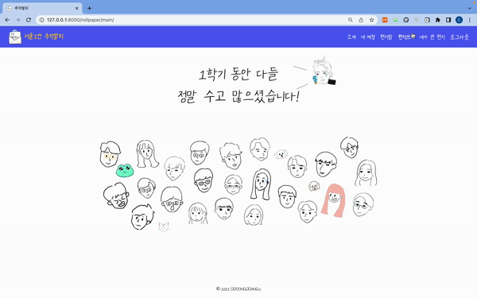
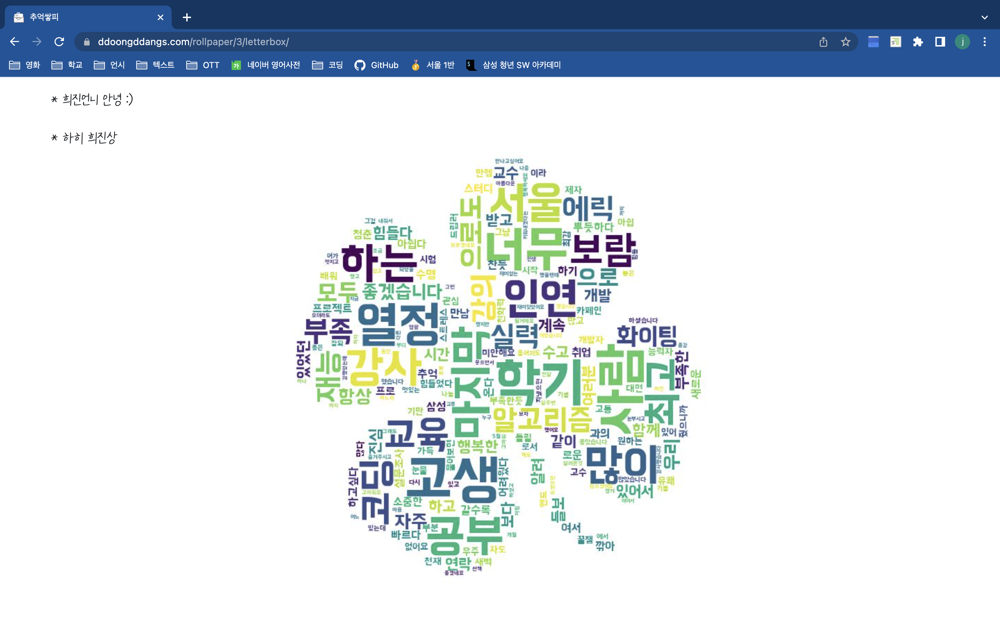
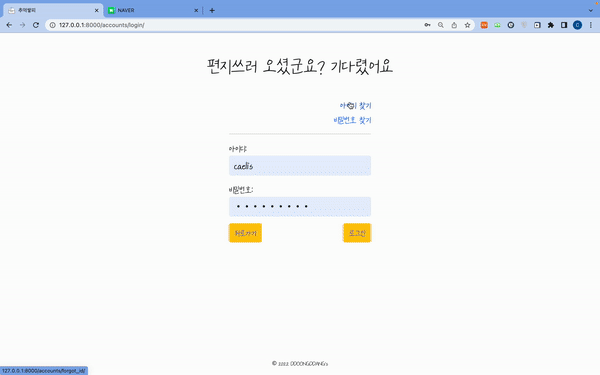
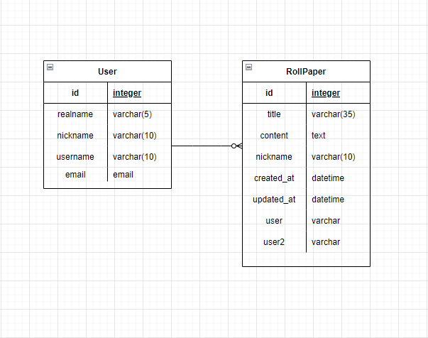

# 서울1반 추억쌓피

---

- 개발 기간: 2022.04.12 ~ 5.23

- 팀명: 뚱땅즈

- 팀원 구성: 김수연, 노희진, 명은호

- 개발언어: HTML, CSS, Python, Javascript

- 개발도구: VSCode, Google Chrome Browser, Bootstrap v5, Django 3.2+

- 목표:

  -  롤링페이퍼 서비스 개발
  -  HTML, CSS, JavaScript, Vue.js, Django 등을 활용한 실제 서비스 설계 
  -  서비스 관리 및 유지보수
  
  

--------

## 1) 역할 및 업무 분담


|  이름  |     역할     |                             내용                             |
| :----: | :----------: | :----------------------------------------------------------: |
| 김수연 |   기획, BE   | 백엔드 서버 구축, 캐릭터 이미지 제작, ERD, accounts CRUD, rollpaper CRUD, 워드클라우드 |
| 노희진 | 기획, BE, FE | User Flow 기획, ERD, accounts CRUD, rollpaper CRUD, 설문조사 기획 |
| 명은호 |   기획, FE   | User Story 기획, 이미지 및 파비콘 제작, git branch 관리, 설문조사 기획, 이스터 에그 및 FE 전반 |

----


## 2) 서비스 소개

- 개발 이유: 비대면 학기의 아쉬움을 달래기 위해 ''동료에게 하고 싶었던 말을 전하는 서비스를 만들어보면 어떨까?' 하는 호기심에서 시작했습니다.


## 3) 컨셉

- 파란색과 노란색을 메인으로 하는 컬러 팔레트를 설정했다.
- 글꼴 (네이버 무료나눔손글씨 가람연꽃)을 설정했다.
- 파비콘 및 메인 페이지 그림을 직접 디자인했다.
- 편지쓰기 기간을 정해 모든 사용자가 편지를 쓸 수 있도록 유도했다.
- 편지함 공개 날짜를 종강 날짜에 맞춰 '서로의 격려 속에 한학기를 잘 마무리하자'는 의미를 더했다.


---------------------

## 4) 주요 기능

- 회원가입 제한 (1반 대상 서비스)

> 서울 1반 회원 (교육생 25명 + 담당 프로 + 담당 교수 = 27명으로 제한)만 가입할 수 있습니다.
>
> 


- 편지쓰기

> 회원가입한 사용자가 목록에 뜨면 원하는 사용자에게 편지를 쓸 수 있습니다. 
>
> 


- 편지 수정하기

> 내가 쓴 편지를 수정할 수 있습니다.
>
> 

  

  

- 워드클라우드 (google survey)

> 사전 설문조사로 받은 답변을 조합해 워드클라우드 이미지를 생성합니다.
>
> 미리 설정해놓은 날짜가 되면 편지함이 공개되고, 편지함 페이지에 워드클라우드 이미지가 출력됩니다.
>
> 


- 편지 확인하기 (d-day)

> 미리 설정해놓은 날짜가 되면 편지함이 공개됩니다.
>
> 해당 날짜 이전에는 편지함을 확인할 수 없습니다.
>
> 

  

- 회원메일을 통한 아이디 찾기

> 회원가입시 사용자로부터 받은 이메일 주소로 사용자의 아이디와 서비스 링크를 함께 보냅니다.
>
> 

  

- 회원메일을 통한 비밀번호 재설정

>  회원가입시 사용자로부터 받은 이메일 주소로 사용자의 비밀번호를 재설정할 수 있는 링크를 보냅니다. (아이디 찾기와 동일)

-----------

## 5) ERD




----------


## 6) 협업에 대하여

1) Git Branch
   - git convention을 지정하지 않아 협업 초반에 master에 직접 작업하는 경우가 종종 있었다.
   - 작업 파일이 겹쳐 merging할 때 충돌하는 경우가 있었다.
   - 초반 일주일 이후 익숙해져 더 이상 git과 관련된 이슈는 발생하지 않았다.

2. 매터모스트, 노션, 디스코드 활용
   - 코드 공유시 매터모스트, 디스코드 활용
   - 회의록, 개발 상세 일정 등은 노션에 기록


## 7) 코드에 대하여

- Back

  

  #### 1) 탈퇴 회원 정보 유지

  > 롤페이퍼 모델에서, 롤페이퍼의 수신인 user, 발신인 user2 필드를 `on_delete=models.SET_NULL` 로 설정시켜, 탈퇴하여도 편지는 삭제되지 않도록 설정했다.
  > 또한, 탈퇴한 회원이 보낸 편지를 확인할 때, 발신인의 닉네임이 유지될 수 있도록, 롤페이퍼 모델에 `nickname` 필드를 추가하여 편지 작성 시 작성자의 `nickname`이 저장되도록 설정했다.
  > 따라서 작성자가 추후에 탈퇴하여도 롤페이퍼에 `nickname`이 저장되기 때문에 수신인은 발신자를 확인할 수 있다.

  

  

  #### 2) 비밀번호 재설정 유효성 검사

  > ‘비밀번호 재설정’ 기능을 구현할 때, 이메일의 유효성 검사가 제대로 이뤄지지 않는 문제가 생겼다. 
  > 이를 해결하기 위해, forms.py에 비밀번호 재설정 form을 만들고, 그 form의 유효성을 검사하는 함수를 추가했다.

  

  

  #### 3) SMTP 보안 이슈

  > 사용자에게 이메일을 보낼 때 장고에 등록해놓은 메일의 보안 수준을 낮게 설정해야 했다. gmail 보안 서비스 정책의 변경으로 인해 서비스 배포 후 2주 뒤 메일 전송과 관련된 '아이디 찾기', '비밀전호 재설정' 기능이 작동하지 않았다. 
  >
  > gmail 에서 naver 메일로 변경 후 새롭게 SMTP 설정을 마친 후 정상 작동하는 것을 확인했다.

  

  

  #### 4) url로 페이지 접근시 발생하는 오류 
  
  > 편지쓰기 url로 접근할 때 이미 편지를 쓴 사용자에게 두번 이상 편지 쓰기가 가능했다. 
  >
  > 해당 오류를 수정하기 위해 rollpaper/views.py의 write 함수에 아래와 같은 조건문을 추가해 오류를 방지했다.
  
  ```python
   elif RollPaper.objects.filter(user2 = request.user, user = receiver).exists():
              return redirect('rollpaper:userlst')
  ```

  

  
  
  #### 5) 워드 클라우드
  
  > 


- Front

  

  #### 1) CSS 컨벤션 부재

  > 프로젝트 초반에 h1, h2, p 태그들에 대해 글꼴 크기를 각각 부여하지 않다보니 static 폴더에 따로 담아놓은 css 서식 파일과 각 페이지의 style 서식 및 부트스트랩의 클래스 서식이 충돌이 많이 되고 overriding도 2차, 3차적으로 하게 되었다.
  >
  > 반응형 구현을 위해 각 template의 style 태그에다가 미디어 쿼리를 사용해서 글꼴과 이미지 height를 다르게 주다보니 코드의 길이는 길어지고 가독성은 떨어지며, 어디에서 적용되는지 찾기 어려워서 유지보수가 안되고 계속 덮어쓰는 형식의 CSS 코드가 만들어졌다.
  >
  > 페이지와 컴포넌트의 개수가 많지 않고 프론트엔드 작업을 하는 사람의 수가 2명이다보니 UI적 완성도에는 문제가 없었지만, 스케일이 커지는 프로젝트의 경우 서로의 코드에 대해 소통이 안되어 치명적인 작업 속도와 유지보수에 관련한 문제가 야기될 수 있다고 생각이 든다. 

  

  

  #### 2) Bootstrap 서식 덮어쓰기

  > Bootstrap 내부적으로 최우선순위로 적용되는 서식들에 대해 (e.g. input 태그나 button 태그를 클릭했을 때 연한 하늘색 outline이 띄워지는 것) 없애주어 사이트 색감이 해치지 않게 보완했다.
  >
  > ```css
  > .btn:focus, .btn:active, .form-control:focus, .form-control:active .navbar-toggler:focus, .navbar-toggler:focus {
  >   outline: none !important;
  >   box-shadow: none !important;
  > }
  > ```

  

  

  #### 3) Viewport에 따른 반응형 구현

  > 반응형 구현이 포함된 프로젝트로써 데스크톱의 landscape 화면과 모바일의 horizontal 화면의 차이를 감안해 단순히 이미지 크기를 줄이는게 아닌, 메인 화면의 이미지를 다르게 뽑아 미디어 쿼리로 적용했다.
  >
  > 총 3가지의 비율로 데스크톱, 태블렛, 그리고 모바일로 구분을 두었다.
  >
  > 이미지 뿐만 아니라 이스터 에그를 배치하는 위치도 변화를 주어 모든 viewport에 관해 최적의 UI를 구현했다.
  >
  > ```css
  >   @media(min-width: 1200px) {
  >     .container {
  >       background-image: url('../../static/images/main_pc.PNG');
  >       background-size: contain;
  >       background-repeat: no-repeat;
  >       background-position: top;
  >     }
  >   }
  > 
  >   @media(max-width: 1200px) and (min-width: 474px){
  >     .container {
  >         background-image: url('../../static/images/main.PNG');
  > 		...
  >       }
  >   }
  >   
  >   @media(max-width: 474px){
  >     .container {
  >       background-image: url('../../static/images/main2.PNG');
  >       ...
  >     }
  >   }
  > ```

  

  

  #### 4) Form에 서식 부여하기

  > 반응형으로도 구현한 template 서식 상 textarea 태그의 max-width 길이를 제한해 두었기 때문에 편지 확인을 위해 불러오는 form도 같은 서식을 유지해야 했다.
  >
  > forms.py에서 widget을 활용해 따로 `letter-title`과 `letter-content`라는 클래스명을 부여하여 template에서 form으로 불러와도 css에서 개별적으로 서식을 관리할 수 있도록 했다.
  >
  > ```python
  > class RollPaperForm(forms.ModelForm):
  >     title = forms.CharField(
  >         ...
  >         widget=forms.TextInput(
  >             attrs={
  >                 'class': 'form-control letter-title',
  >                 },
  >         )
  >     )
  >     content = forms.CharField(
  >         ...
  >         widget=forms.Textarea(
  >             attrs={
  >                 'class': 'form-control letter-content',
  >             },
  >         )
  >     )
  > ```


## 8) 성과

- ssafy 8기 공식 롤링페이퍼 서비스로 런칭예정


## 9) 서비스 확장을 위해

- 워드클라우드 실시간 받기
- 링크 공유를 통한 방 생성 및 회원가입
- 본인인증 (중복 계정 예방 차원)


